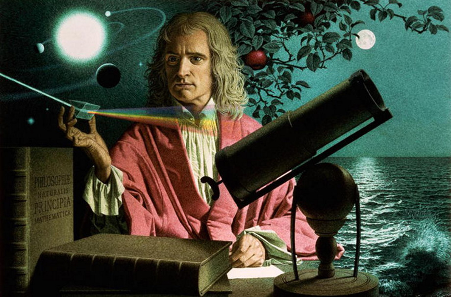
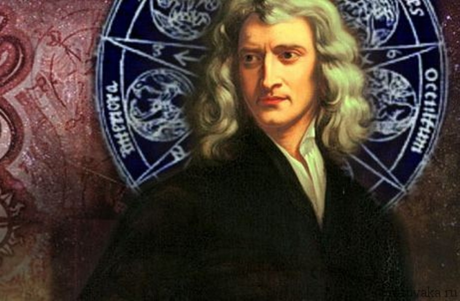
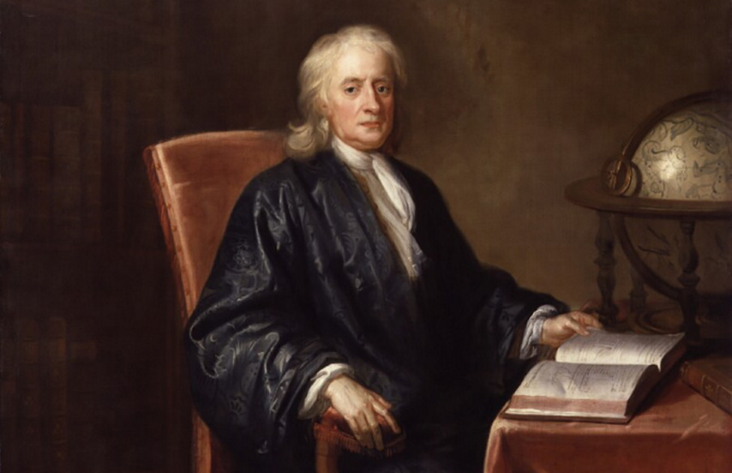
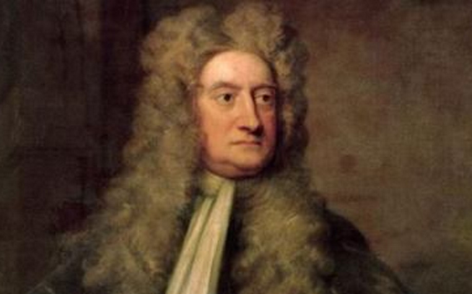
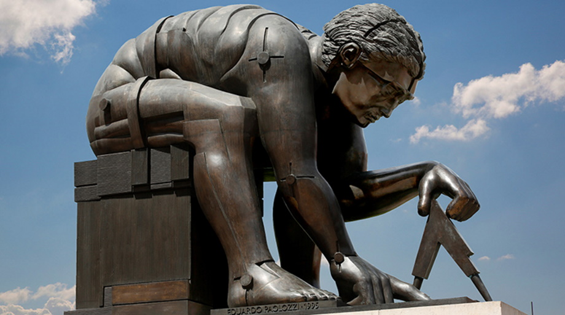

<!doctype html>
<html>
<head>
<meta charset="utf-8">
<title>Исаак Ньютон</title>
<meta name="generator" content="WYSIWYG Web Builder 16 Trial Version - https://www.wysiwygwebbuilder.com">
<link href="Галерея_ученых.css" rel="stylesheet">
<link href="Niuton.css" rel="stylesheet">

<script src="wb.slideshow.min.js"></script
</head>
<body>

<strong>ИСААК НЬЮТОН (1643-1727)</strong>

<strong><a href="https://ru.wikipedia.org/wiki/%D0%93%D0%B0%D0%BB%D0%B8%D0%BB%D0%B5%D0%B9,_%D0%93%D0%B0%D0%BB%D0%B8%D0%BB%D0%B5%D0%BE" target="_blank">Исаак Ньютон</a></strong> - талантливый человек, который является автором работы «Математические начала натуральной философии». Это физик и математик, астроном и механик. Исаак Ньютон родился 4 января 1643 года в деревне Вулсторп в Королевстве Англия. Его отец был преуспевающим фермером. Он не дожил до рождения сына. Мальчика назвали в честь отца.
В 1655 году юноша поступил в школу в Грэнтеме. Затем Исаак продолжил обучение в Кембриджском университете. После экзамена по латинскому языку его приняли в Тринити-колледж.
Ньютон сделал свое первое открытие и стал бакалавром. Он вдохновлялся научными трудами Галилео Галилея, Рене Декарта, Иоганна Кеплера. Юноша завершил работы известных людей и объединил их в универсальную систему мира.
В юном возрасте он сделал большую часть научных открытий. Исаак постоянно экспериментировал и искал ответы на свои вопросы. Он разработал прямой метод флюксий, теорию цветов и метод приближенных рядов.
Самым значительным открытием Ньютона считается закон всемирного тяготения, под которым подразумевается гравитационное взаимодействие в рамках классической механики. 
Известный физик и математик умер 31 марта 1727 года, находясь в Кенсингтоне.

<iframe id="YouTube1" src="https://www.youtube.com/watch?v=BMR7O_MqNP8" allowfullscreen></iframe>

<ul class="navbar">
<li><a href="Urok 5.html"></a></li>
<li><a href="Aristotel.html"></a></li>
<li><a href="Kopernik.html"></a></li>
<li><a href="Galiley.html"></a></li>
<li><a href="Niuton.html"></a></li>
</ul>

<strong> Tverdaya Serafima </strong>

</body>
</html>
