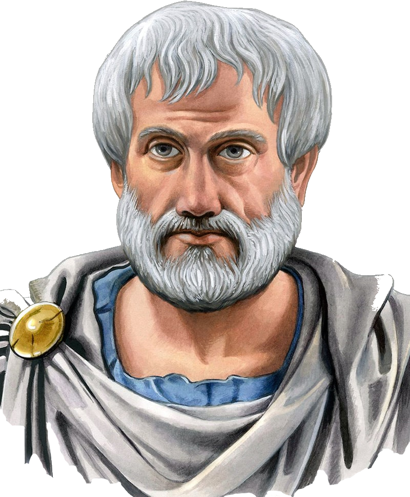

<!doctype html>
<html>
<head>
<meta charset="utf-8">
<title>Галерея ученных</title>
<link href="Галерея_ученых.css" rel="stylesheet">
<link href="Style.css" rel="stylesheet">

</head>
<body>

<strong><a href="aristotel.html">Аристотель</a></strong>

<strong><a href="kopernik.html">Николай Коперник</a></strong>

<strong><a href="galilei.html">Галилео Галилей</a></strong>

<strong><a href="niuton.html">Исаак Ньютон</a></strong>

<strong>Аристотель научил меня удовлетворять свой разум только тем, в чем убеждают меня рассуждения, а не только авторитет учителя. </strong>&nbsp;&nbsp; &nbsp;&nbsp; &nbsp;&nbsp; &nbsp;&nbsp; &nbsp;&nbsp; &nbsp;&nbsp; &nbsp;&nbsp; &nbsp;&nbsp; &nbsp;&nbsp; &nbsp;&nbsp; &nbsp;&nbsp; &nbsp;&nbsp; &nbsp;&nbsp; &nbsp;&nbsp; &nbsp;&nbsp; &nbsp;&nbsp; &nbsp;&nbsp; &nbsp;&nbsp; &nbsp;&nbsp; &nbsp;&nbsp; &nbsp;&nbsp; &nbsp;&nbsp; &nbsp;&nbsp; &nbsp;&nbsp;&nbsp;&nbsp; <em>Галилео Галилей</em>

<ul class="navbar">
<li><a href="urok.html"></a></li>
<li><a href="aristotel.html"></a></li>
<li><a href="kopernik.html"></a></li>
<li><a href="galilei.html"></a></li>
<li><a href="niuton.html"></a></li>
</ul>

<strong>Tverdaya Serafima,8 class</strong>

</body>
</html>
